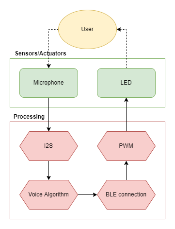
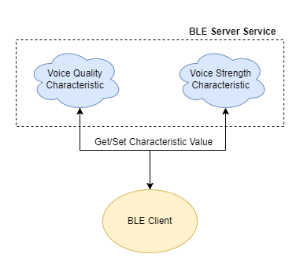
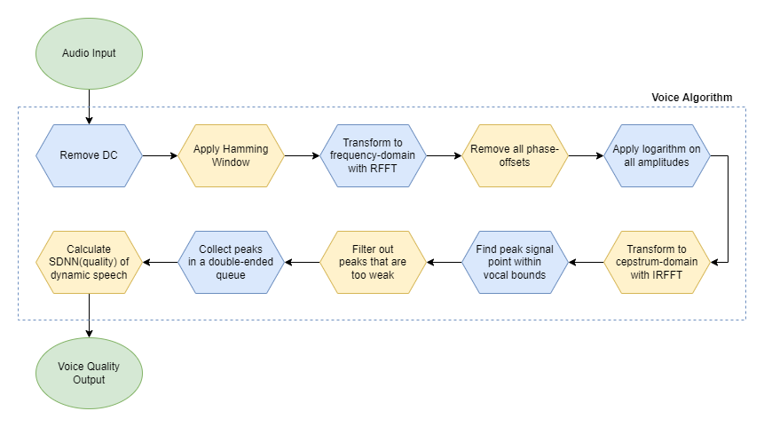

# ESP32-APPS
Provides real-time feedback to Parkinson patients on their dynamic speech quality.

This is a multi-core application that constantly processes audio input and sends feedback values on dynamic speech quality if it detects male voice.\
Uses ESP32. Tested on ESP32 TinyPico.\
Uses INMP441 Microphone Module.\
Source code headers are Doxygen-documented. HTML webpages were generated for the most recent source code documentation, these webpages are found alongside the source code files.

## General IPO Diagram

## BLE Diagram

## Voice Algorithm Diagram

